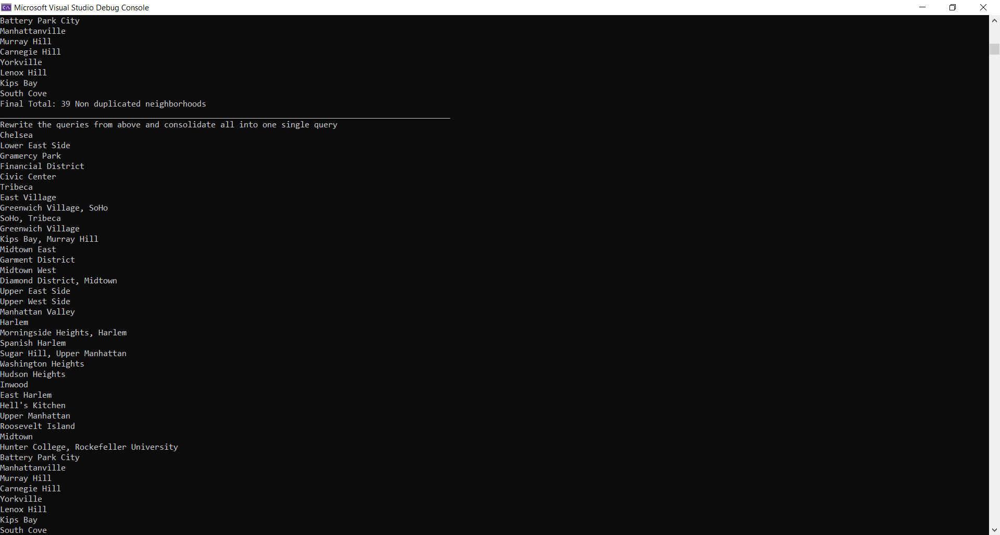

# LINQ in Manhattan
# Summary:
The provided code is a C# program that demonstrates the use of LINQ (Language Integrated Query) to process data from a JSON file.
It focuses on analyzing neighborhood information in Manhattan. 
The program reads the JSON data, performs various queries and transformations using LINQ, and outputs the results to the console.
 
# Visuals:
As the code runs, it displays the neighborhoods based on different queries, along with the final total count of neighborhoods, to the console.
                    
       

                    All Neighborhoods:
                    Chelsea
                    Lower East Side
                    Gramercy Park
                    Financial District
                    ...
                   Final Total: 147 neighborhoods
                   ______________________________________________________________________________________________
                   All The Named Neighborhoods:
                   Chelsea
                   Lower East Side
                   Gramercy Park
                   Financial District
                   ...
                   Final Total: 143 Named neighborhoods
                   ________________________________________________________________________________________________
                   Non Duplicated Neighborhoods :
                   Chelsea
                   Lower East Side
                   Gramercy Park
                   Financial District
                   ...
                   Final Total: 39 Non duplicated neighborhoods
                   ________________________________________________________________________________________________
                   Rewrite the queries from above and consolidate all into one single query
                   Chelsea
                   Lower East Side
                   Gramercy Park
                   Financial District
                    ...
                   Final Total: 39 Non duplicated neighborhoods
                   ________________________________________________________________________________________________
                   ________________________________________________________________________________________________
                   Rewrite  one of these questions  using the LINQ Query  syntax 1
                   Chelsea
                   Lower East Side
                   Gramercy Park
                   Financial District
                    ...
                   Final Total: 147 neighborhoods
                   ______________________________________________________________________________
                   ________________________________________________________________________________________________
                   Rewrite  one of these questions  using the LINQ Query  syntax 2
                   Non Duplicated Neighborhoods :
                   Chelsea
                   Lower East Side
                   Gramercy Park
                   Financial District
                   ...
                   Final Total: 39 Non duplicated neighborhoods

# Usage
To use the programm do the following : 
- Make sure that you have the necessary prerequisites:

  *  A development environment with C# support (e.g., Visual Studio, Visual Studio Code, or any other C# IDE).
  - The Newtonsoft.Json NuGet package should be automatically restored during the build process.
- Clone the repository
- Open the project in the development environment:

- Build the project:

- Obtain the JSON file:

Make sure the "Neighborhoods.json" file with the provided JSON data is included in the project's root folder.
- Run the code:

Run the project in the development environment (e.g., press F5 or use the "Run" command).
The console should display the neighborhoods based on the queries defined in the code.
Each set of neighborhoods will be accompanied by the final total count of neighborhoods.
# Relevant Details:

- The code uses the Newtonsoft.Json library
- The "Neighborhoods.json" file is located in the same directory as the project.
- The code demonstrates both LINQ method syntax and query syntax.
- There are differnt operations on the neighborhood data such as filtering, projection, and distinct .
